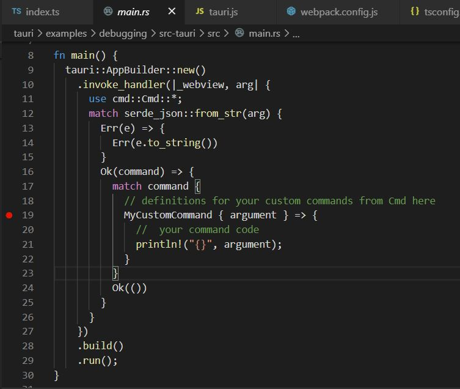

# Debugging Tauri Applications

Tauri applications have two primary code bases, the native code (Rust) and the client code (Javascript). This readme explains how to debug both using VS Code.

## Debugging with VS Code on Windows

This section illustrates debugging with VS Code on Windows.

### Rust

Rust can be debugged by attaching a debugger while the application is running. 

First, enable the Microsoft C/C++ extensions `ms-vscode.cpptools`.

Next, in your `launch.json`, create a new config `C/C++: (Windows) Attach`. The result should look something like this

```
{
    "name": "(Windows) Attach",
    "type": "cppvsdbg",
    "request": "attach",
    "processId": "${command:pickProcess}"
}
```

Then, launch the application, either by `npm run tauri dev` or by manually launching `./src-tauri/target/debug/debug-example.exe`.

Set a breakpoint in your Rust code. See the image below...



Finally, start debugging by launching `(Windows) Attach`; this will prompt you to select a process, simply start typing `debug-example.exe`, and select that when it appears in the list.

When you click `click me` on the client, you will hit that breakpoint.

### Javascript

!Attention! This section requires the Windows Webview2 SDK. This comes with Microsoft Edge! Be sure to update Microsoft Edge to the latest version! You can still debug the Javascript by using the Edge DevTools, but the VS Code debugging extension does not support it.

This walkthrough will show you how to set up the debugger to debug the Javascript portion of a Tauri project.

The setup for this walkthrough assumes you are using `Webpack` and the `Webpack Dev Server`. At the end of the walkthrough, you should be able to set breakpoints on source files (`.js, .ts, .tsx, etc`) and debug in VS Code.

First install `Debugger for Microsoft Edge` (`msjsdiag.debugger-for-edge`). 

Next create a launch config like below - this will tell VS Code to launch the Tauri executable and then attach the Javascript debugger.

```
{
    "name": "Launch client run",
    "type": "edge",
    "request": "launch",
    "url": "about:blank",
    "breakOnLoad": false,
    "webRoot": "${workspaceFolder}",
    "useWebView": true,
    "runtimeExecutable": "${workspaceFolder}/src-tauri/target/debug/debug-example.exe",
}
```

Now, you need to build the debug executable to work with the Webpack Dev Server. 
Specify the Webpack Dev Server host port in the `src-tauri/tauri.conf.json`.

```
"build": {
    "distDir": "../dist",
    "devPath": "http://localhost:4000",
    "beforeDevCommand": "",
    "beforeBuildCommand": ""
},
```

`npm run tauri dev` will build the executable. However, this will build an executable that expects the Webpack Dev Server at a different port number. E.g. If you specified port 4000 in `tauri.conf.json`, the executable will build in port 4001.

Cancel the `npm run tauri dev` process.

Next, start the Webpack Dev Server at the port specified in the previous step. E.g. 4001 - this is the default for this repo. `npm run dev`.

Finally, you can start the debugger using the launch configuration created above.